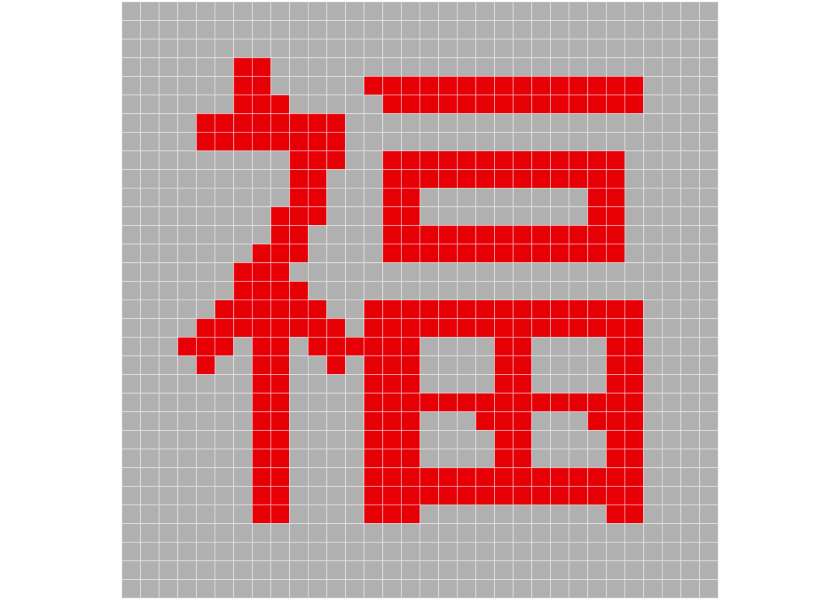
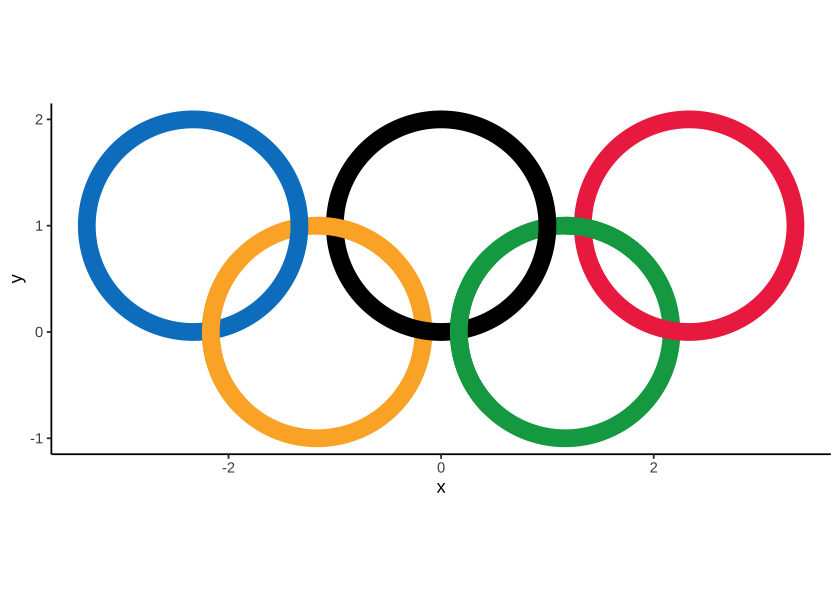
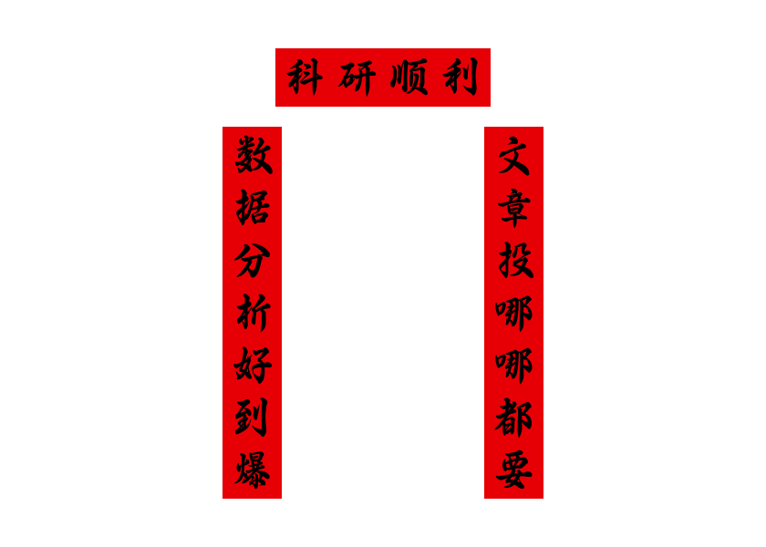

# plot4fun

`plot4fun` provides many interesting functions for plotting, such as `make_LED`, plot `Olympic_rings` and so on.

## Install


```r
install.packages("devtools")
devtools::install_github("Asa12138/plot4fun")
```

## Find fun

### make a LED

We can use `convert_chr_to_matrix` to convert a character to 01 matrix, then plot it easily.

```r
achr <- convert_chr_to_matrix("福")
plot(achr)
```

<!-- -->

After that, we can try to make a dynamic LED screen:


```r
make_LED("一起来画图！")
```

<!-- -->

### Olympic_rings

How to use ggplot to draw a standard Olympic rings?

Because the real Olympic rings will be nested, we need to handle the relationship between layers to display the correct graphics.


```r
Olympic_rings() + theme_classic()
```

<!-- -->

### Chunlian

Spring couplets, also known as "spring paste", "door pair", "couplets", is a kind of red festive elements "Nian red" posted during the New Year. It is a unique literary form in China, depicting beautiful images and expressing good wishes with neat and concise words.


```r
chunlian(c("科研顺利","数据分析好到爆","文章投哪哪都要"))
```

<!-- -->

### Game of Life
<https://conwaylife.com/wiki/Conway%27s_Game_of_Life>

> Conway's Game of Life, also known as the Game of Life or simply Life, is a cellular automaton devised by the British mathematician John Horton Conway in 1970. It is the best-known example of a cellular automaton.
>
> The "game" is actually a zero-player game, meaning that its evolution is determined by its initial state, needing no input from human players. One interacts with the Game of Life by creating an initial configuration and observing how it evolves.


```r
life_game(size = 40,time = 20,fps = 1)
```

<!-- -->

