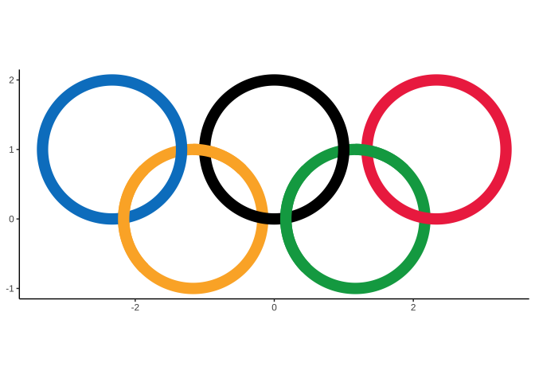

<!-- README.md is generated from README.Rmd. Please edit that file -->

# plot4fun 

<!-- badges: start -->

[](https://github.com/Asa12138/plot4fun/actions/workflows/R-CMD-check.yaml)
[](https://asa-blog.netlify.app/)
[](https://cran.r-project.org/package=plot4fun)
[](https://cran.r-project.org/package=plot4fun)
[](https://cran.r-project.org/package=plot4fun)
[](https://github.com/Asa12138/plot4fun)
<!-- badges: end -->

`plot4fun` provides many interesting functions for plotting, such as
`make_LED`, plot `Olympic_rings` and so on.

## Installation

You can install the development version of `plot4fun` from
[GitHub](https://github.com/) with:

The HTML documentation of the latest version is available at [Github
page](https://asa12138.github.io/plot4fun/).

``` r
# install.packages("devtools")
devtools::install_github("Asa12138/plot4fun")
```

## Find fun

### plot a clock

``` r
clock()
```


### github contribution calendar

``` r
show_github_calendar(usr = "asa12138", color = "skyblue")
```


### make a LED

We can use `convert_chr_to_matrix` to convert a character to 01 matrix,
then plot it easily.

``` r
achr <- convert_chr_to_matrix("福")
plot(achr)
```


After that, we can try to make a dynamic LED screen:

``` r
make_LED("一起来画图！", image_scale = 2)
```


### Olympic_rings

How to use ggplot to draw a standard Olympic rings?

Because the real Olympic rings will be nested, we need to handle the
relationship between layers to display the correct graphics.

``` r
Olympic_rings() + theme_classic()
```



### Chunlian

Spring couplets, also known as “spring paste”, “door pair”, “couplets”,
is a kind of red festive elements “Nian red” posted during the New Year.
It is a unique literary form in China, depicting beautiful images and
expressing good wishes with neat and concise words.

``` r
chunlian(c("科研顺利", "数据分析好到爆", "文章投哪哪都要"))
```


### Game of Life

<https://conwaylife.com/wiki/Conway%27s_Game_of_Life>

> Conway’s Game of Life, also known as the Game of Life or simply Life,
> is a cellular automaton devised by the British mathematician John
> Horton Conway in 1970. It is the best-known example of a cellular
> automaton.
>
> The “game” is actually a zero-player game, meaning that its evolution
> is determined by its initial state, needing no input from human
> players. One interacts with the Game of Life by creating an initial
> configuration and observing how it evolves.

``` r
life_game(size = 40, time = 20, fps = 1)
```


